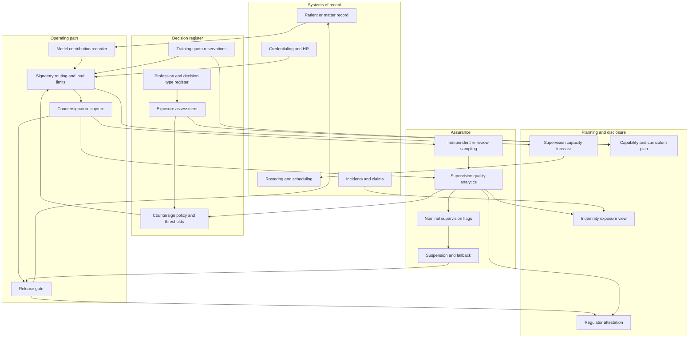

# Countersign

**Source:** `ai-in-hr/Accenture-How-Will-AI-Impact-The-Workforce-Transcript/`
**Domain:** `ai-hr`
**One-liner:** A decision-level exposure and supervision register for licensed professions that records which professional judgments a machine may produce, who must countersign each one, whether that countersignature is real or a rubber stamp, and how many training-grade decisions must stay with humans to keep the qualification pipeline alive.
**Wedge:** Multi-site regulated employers of 500–5,000 licensed professionals — a hospital group's diagnostic and medication-review services, an audit firm's assurance practice, or a legal services provider's advisory bench — instrumented on the twenty highest-volume decision types in one licensed discipline.
**Positioning:** Professional liability infrastructure for machine-assisted judgment. The market frames this as a productivity question; the binding constraint is licensure. A machine output only becomes an act of professional practice when a licence-holder adopts it, and nothing today records whether that adoption was a judgment or a reflex. Countersign owns that record — and with it, the workforce plan, the supervision roster, the training quota and the indemnity exposure that all depend on it.

## Market research synthesis

### Thesis from source

The source is brief and makes one claim with unusual force. It identifies "the next wave where AI will be replacing white collar jobs" and names the occupations directly: "lawyers, accountants, and doctors." It then commits to a specific and testable prediction about the frontier: "we're not that far away from being in a position where ninety percent of the diagnostics and the prescription in medicine are going to be coming just as accurately if not more accurately from AI." Note what is being claimed — not that machines will assist with paperwork, but that the substantive, licensed, liability-bearing outputs of medicine will be machine-produced at near-total volume and at parity or better accuracy.

The source then asks the only question that matters operationally — "what kind of implication is that going to have the workforce where lawyers, accountants, and doctors are being replaced by AI?" — and answers it by relocating value: it "changes the emphasis of education requirements of what humans are to saying, actually, the thing that fundamentally we will value the most will be creativity." Humans, it argues, "will add creative dynamism, and therefore we need to make sure that the education system and universities are able to develop critical thinkers, creative problem solvers, as well as accountants, engineers, and lawyers." The formulation "as well as" is important: the source is not predicting the abolition of the professions, it is predicting a change in the composition of professional work and therefore in the pipeline that supplies it.

The domain reasoning the source leaves implicit is where the product lives. Professional work is not a job; it is a bundle of decision types, each carrying a regulatory attribution requirement. A diagnosis, a prescription, an audit opinion, a legal advice letter, a capacity assessment, a fitness-to-fly certification — each has rules about who may sign, what supervision the signer owes, what record must be kept, and who carries liability when it goes wrong. Accuracy parity does not dissolve those rules. If a model reaches 90% of diagnostics at parity, the licensed professional's work does not disappear; it converts into countersignature, exception handling and accountability. That conversion is where the risk concentrates, because a professional countersigning hundreds of machine outputs a day is performing supervision in name only, and the organisation has both a liability exposure and a regulatory exposure that nothing in its current stack can see. Clinical audit samples a few cases a quarter. Engagement quality review samples files. CPD logs record hours, not judgment. None of them measure whether supervision is real.

The second implicit consequence is the one professional-services leaders most consistently miss. Junior professional work is not merely cheap production; it is the training substrate through which people qualify. Trainee doctors learn by reporting studies under supervision, trainee auditors by testing samples, trainee lawyers by drafting. Automating the routine layer removes the exact work on which qualification depends, and the effect surfaces five to ten years later as an irreplaceable shortage of senior judgment — the very capability the source says will be most valued. An organisation that automates its way out of its own training pipeline has traded a margin gain now for a capability collapse later. Countersign therefore treats training-grade decision volume as a reserved resource with a quota, in the same way a utility reserves capacity.

What follows is a narrow product with a hard edge: a register in which every material professional decision type is classified on two axes — how much of it a machine can produce, and how it may lawfully be attributed — with a countersignature policy per type, instrumentation of whether countersignature is being performed meaningfully, a reserved quota of training-grade decisions, and a capability plan that shifts licensed hours toward the critical-thinking and creative problem-solving work the source says will carry the value.

### Buyer & economic model

- **Primary buyer:** the accountable professional leader — chief medical officer, head of assurance quality, or managing partner — co-signed by the chief risk officer, because the purchase is justified on liability and regulatory exposure before it is justified on productivity.
- **Users:** licensed professionals performing and countersigning decisions, supervising consultants and engagement partners, quality and clinical governance officers, workforce planners and rota managers, training programme directors and education leads, professional indemnity underwriters and brokers, and regulators or professional bodies consuming attestations.
- **Budget owner / value metric:** the clinical governance, quality and risk budget, with a second funding line from workforce planning. The value metric is supervised decision throughput per licensed professional at constant or improved quality, alongside claims and complaint exposure per thousand decisions; the strategic metric is the share of licensed hours spent on decision types a machine cannot produce.
- **Competing status quo:** retrospective peer review and clinical audit on small samples, engagement quality reviews after the file closes, CPD hour logs, a workforce plan built on headcount ratios and vacancy rates, an AI governance committee with no operational link to rosters or supervision, and indemnity pricing based on specialty and claims history rather than on how machine-assisted the work actually is.

### Domain constraints

- **Regulatory / trust / safety:** scope of practice and delegation rules define who may perform and sign each decision type, and supervision requirements are often expressed as ratios or as physical or same-shift availability. Professional indemnity and vicarious liability turn on whether supervision was adequate in fact, not on whether a policy existed. Clinical decision support crosses into medical device regulation at defined thresholds, which changes the evidentiary burden on the organisation deploying it. Client and patient disclosure obligations increasingly require telling the person that automation contributed to a decision about them. Regulators and professional bodies inspect against their own standards and will ask for evidence, not assurances.
- **Data sensitivity:** decision-level records tie an identified licence-holder to a judgment, so the dataset is simultaneously patient or client data and employee performance data. Countersignature dwell times and override rates are extremely sensitive: they are legitimate supervision-quality signals and, misused, are individual surveillance. Machine-producibility scores are equally hazardous — if used to select individuals for redundancy they become the evidential centre of an unfair-dismissal or discrimination claim, so the product must keep exposure assessment at decision-type level and forbid its use as an individual selection criterion.
- **Change-management realities:** professionals will not accept a system that appears to audit their clinical or professional judgment on efficiency grounds, so the framing and the governance must be peer-led, with the professional body's standards as the reference. Training directors and service managers have directly opposed incentives on training-grade work, and the quota only holds if it is enforced by the rostering and work-allocation path rather than by goodwill. Indemnity insurers move slowly, so the commercial case cannot depend on immediate premium relief.

## Business requirements

- BR-1: Every material professional decision type in scope must be registered with its licensure requirement, its permitted signatories, its supervision rule and its liability owner, before any automation is permitted to produce output against it.
- BR-2: Machine-producibility must be assessed and recorded per decision type with stated evidence, and must never be applied to an individual professional or used as a criterion in redundancy selection, retention or promotion.
- BR-3: No machine-produced output may be released as an act of professional practice without an identified licence-holder's countersignature, recorded with the time taken, the material reviewed and any amendment made.
- BR-4: Countersignature quality must be measured and reported — dwell time distribution, override and amendment rate, and calibration against independent re-review — and a signatory or decision type whose pattern indicates rubber-stamping must trigger review and, where thresholds are breached, suspension of automated release for that type.
- BR-5: A minimum quota of training-grade decisions must be reserved for supervised trainees on each decision type, expressed as an absolute volume per trainee per period, and automation must be throttled rather than the quota breached.
- BR-6: Supervision capacity must be planned as a scheduled resource: every period must show that the licensed supervisors rostered can discharge the countersignature and supervision load implied by forecast decision volume, with the shortfall quantified before it occurs.
- BR-7: The organisation must be able to demonstrate, for any individual decision, which model version and which rule or guideline version contributed to it, who adopted it, and what disclosure was made to the patient or client.
- BR-8: Capability planning must show the shift of licensed professional hours toward decision types that are not machine-producible — complex judgment, ethical trade-offs, client and patient counsel, novel problem framing — with a measured baseline and target, in line with the source's claim that creativity and critical thinking become the valued contribution.
- BR-9: Education and curriculum gaps implied by the exposure assessment must be recorded and shared with the relevant training programme, university partner or professional body on a defined cycle, because the source's prescription is explicitly about the supply pipeline and not only about the employer.
- BR-10: Professional indemnity exposure must be reportable by decision type and by degree of machine assistance, so that disclosure to insurers is evidence-based and premium negotiation reflects the actual control environment.
- BR-11: Any decision type where automated release is suspended must fall back to full human production without service interruption, and the fallback capacity must be maintained rather than assumed.
- BR-12: Decision records, countersignature evidence, model and guideline versions, supervision rosters and training quota compliance must be retained for the longest applicable limitation period for professional negligence claims in each jurisdiction, with an append-only history.

## User stories

Canonical user stories live in sibling [USER_STORIES.md](USER_STORIES.md).

## System design

### Overview

Countersign is organised around the decision type rather than the role. For each registered decision type it holds the licensure and supervision rules, the permitted signatories, the current machine-producibility assessment with its evidence, and a countersignature policy stating what the signatory must review and what release conditions apply. In operation, each decision instance flows through the register: a machine contribution is recorded with its model version, the decision is routed to an eligible signatory subject to load limits and training-quota reservations, the countersignature is captured with dwell time and amendments, and a sampling engine sends a proportion of countersigned decisions for independent re-review to calibrate whether adoption was sound. Aggregate patterns drive three planning outputs — supervision capacity requirements for the roster, training quota compliance for the education programme, and a capability plan describing how licensed hours are shifting toward non-producible work — plus an indemnity exposure view and regulator-facing attestations. Threshold breaches suspend automated release and activate the maintained human fallback.

### Actors & boundaries

- **Actors:** licensed professional, supervising consultant or engagement partner, trainee professional, quality and clinical governance officer, training programme director, workforce planner and rota manager, risk officer, indemnity underwriter, regulator or professional body, and the model or decision-support system as a recorded contributor.
- **Trust boundary:** decision content stays within the clinical or client system of record; Countersign holds decision metadata, attribution and supervision evidence, with references rather than copies of the substantive material wherever possible. Individual countersignature metrics are visible to the signatory and to their named supervising professional within a peer-governed process; they are exposed upward only as service-level aggregates. Machine-producibility assessments are decision-type scoped and are structurally prevented from joining to individual performance or selection datasets.
- **Human-in-the-loop points:** countersignature of every releasable decision; supervising professional review of nominal-supervision flags; governance sign-off on classification and threshold changes; independent re-review adjudication; training quota exception approval; suspension and reinstatement of automated release.

### Core capabilities

1. **Profession and decision-type register** — licensure requirements, permitted signatories, supervision rules, liability owner, and disclosure obligations per decision type.
2. **Exposure assessment** — evidenced machine-producibility and attributability classification per decision type, with review cadence and change history.
3. **Countersignature capture and routing** — eligibility checks, load limits, dwell time, material reviewed, amendments, and release gating.
4. **Supervision quality analytics** — dwell distribution, override and amendment rates, nominal-supervision detection, and independent re-review calibration.
5. **Training pipeline protection** — reserved training-grade quotas per decision type and trainee, automation throttling, and rotation-level compliance.
6. **Supervision capacity planning** — forecast decision volume against rostered supervisor availability, with quantified shortfall and roster feedback.
7. **Capability and curriculum planning** — licensed-hour composition by producibility class, capability gaps, and curriculum feedback to training and education partners.
8. **Liability and indemnity exposure** — exposure by decision type and machine-assistance level, incident linkage, and underwriter disclosure packs.
9. **Suspension, fallback and reinstatement** — threshold-driven suspension of automated release with maintained human fallback capacity.
10. **Attestation and audit** — regulator and professional-body attestations, and full decision-level lineage retained for the negligence limitation period.

### Conceptual data

- **Primary entities:** Profession, DecisionType, ScopeRule, SupervisionRule, ExposureAssessment, MachineProducibilityScore, AttributabilityClass, CountersignPolicy, ModelContribution, DecisionInstance, CountersignEvent, AmendmentRecord, ReReviewSample, NominalSupervisionFlag, SignatoryEligibility, SupervisionRoster, SupervisionCapacityForecast, TrainingQuota, TraineeAssignment, CompetenceProfile, CurriculumGap, DisclosureRecord, IndemnityExposure, SuspensionEvent, RegulatorAttestation.
- **Critical events:** decision type registered and classified; exposure assessment reviewed or changed; model contribution recorded; decision routed to signatory; countersignature completed, amended or refused; re-review sample returned concordant or discordant; nominal-supervision flag raised; training quota consumed or breached; supervision capacity shortfall forecast; automated release suspended and reinstated; disclosure made to patient or client; attestation issued.
- **Retention / audit needs:** decision-level lineage — model version, guideline version, signatory, dwell time, amendments, disclosure — retained for the longest professional negligence limitation period in the jurisdiction, which for paediatric and latent-injury clinical claims extends decades. Exposure assessments, thresholds, suspensions and training quota records retained for the life of every decision they governed. Individual countersignature metrics retained on a short rolling window for supervision purposes and aggregated thereafter.

### Integrations (conceptual)

- **Systems of record:** the electronic patient record, practice management or matter management system where decision content lives; the rostering and scheduling system; the HR and credentialing system holding licence status, scope and revalidation dates; the incident and complaints system; the professional indemnity and claims system.
- **Upstream signals:** clinical decision support and diagnostic model outputs with version identifiers, document assembly and review tools in legal and audit workflows, regulator and professional body standards updates, training programme curricula and rotation schedules, and credentialing feeds confirming a signatory is licensed and in scope today.
- **Downstream actions:** release or hold of a decision in the system of record, routing and load balancing to eligible signatories, roster adjustment requests where supervision capacity is short, throttling instructions to the automation platform when a training quota is at risk, curriculum gap reports to education partners, indemnity disclosure packs, and attestation exports to regulators.

### High-level architecture

The register is upstream of everything. A decision cannot be released, a supervisor cannot be rostered, and a trainee cannot be starved of work without the register having said so first.

### Success metrics

- **Leading:** share of material decision types registered with licensure, supervision rule and countersignature policy; share with a current evidenced exposure assessment; countersignature dwell-time distribution against the policy floor per decision type; override and amendment rate; re-review concordance rate on countersigned decisions; training quota consumption against reservation; forecast supervision capacity coverage for the next roster period; automated release suspensions detected by threshold rather than by incident.
- **Lagging:** supervised decision throughput per licensed professional at constant or improved re-review concordance; claims, complaints and never-event exposure per thousand decisions by machine-assistance level; share of licensed hours spent on non-producible decision types against baseline; trainee progression and time-to-qualification against pre-automation cohorts; indemnity premium and excess movement attributable to evidenced control improvements; regulator and professional body findings closed without adverse finding on supervision adequacy.

## OpenAPI skeleton

Canonical HTTP surface lives in sibling [openapi.yaml](openapi.yaml). Summary:

- **Base path:** `/v1/...`
- **Auth:** `X-API-Key` for clinical, matter, rostering and model-platform system integration; Bearer JWT for professional, supervisor, governance, training and risk sessions with licence-scoped claims.
- **Resource groups:** Professions, Exposure, Countersignature, Supervision, Training Pipeline, Capability, Liability, Attestation, Reporting.
