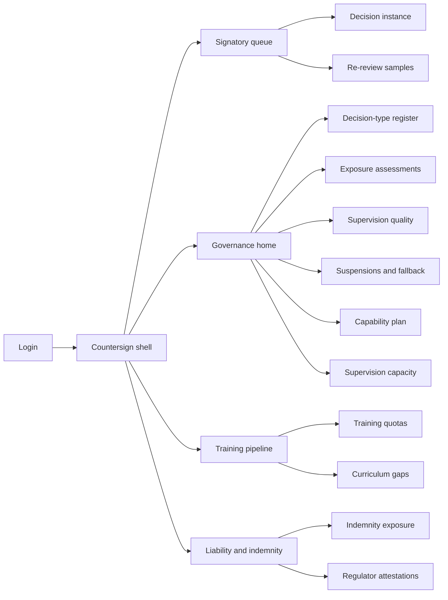
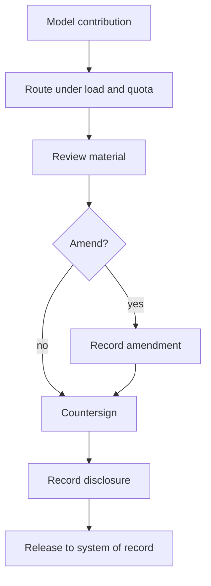
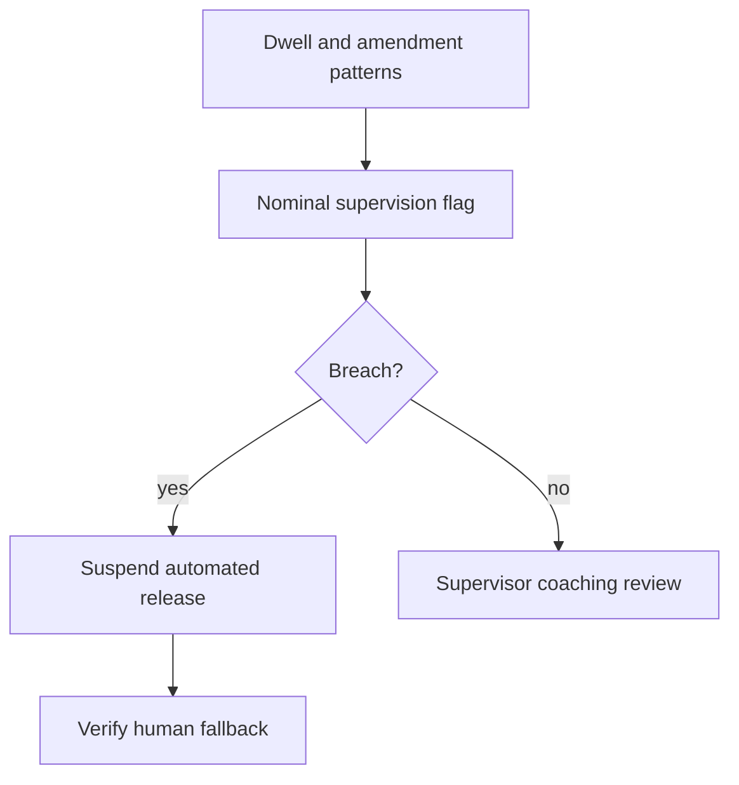

# Countersign — Web app

**Product:** [PRODUCT.md](./PRODUCT.md)
**Primary surface:** Professional countersignature console (licensed signatory + governance workspace)
**Secondary surfaces:** Training quota and curriculum portal; indemnity underwriter attestation pack (read-only export)
**Design thesis:** Countersign is a notarial register for machine-assisted judgment — not a productivity cockpit. The UI metaphor is a wet-ink countersignature blotter: every releasable decision shows the machine contribution, the licence-holder who adopts it, dwell time, amendments, and disclosure before release. Visual language is charcoal parchment with brass confirmation and ink-red suspension — rubber-stamp patterns feel provisional and loud; real review feels settled and quiet. The brand wordmark sits as a small embossed seal on every decision lineage and regulator attestation so liability parties know whose supervision record they are trusting.

## UX research synthesis

### Category peers (best-in-class)

- **Epic / Cerner CDS acknowledge patterns:** Clinician must acknowledge decision-support before order release, with override reasons. Steal: release gate tied to named licence-holder and material reviewed; reject alert-fatigue floods that train rubber-stamping.
- **Relativity / audit EQ tools (Engagement Quality Review):** File sampling, concordance, partner sign-off trails. Steal: independent re-review as a first-class object; reject after-the-fact “quality theatre” disconnected from live release.
- **Clio / practice management matter workflows:** Matter-scoped actions with clear authorship. Steal: decision instance as the atomic work object; reject timesheet-first UIs that treat judgment as billable minutes only.
- **Allocate / Opta rostering (clinical workforce):** Capacity vs demand before the shift. Steal: supervision load tested against roster before volume increases; reject headcount-only vacancy dashboards.

### Patterns to adopt / reject

- **Adopt:** Decision-type register before any automation produce; countersign with dwell + amendments; nominal-supervision flags; training quotas that throttle automation; supervision capacity forecast; suspension with maintained human fallback; indemnity by machine-assistance level; producibility at type level only (never individual selection).
- **Reject:** Individual “AI productivity” scores; rubber-stamp-friendly one-click approve-all; purple AI diagnosis theatre; training quota as a soft KPI; editable settled lineage; marketplace-style “AI replaces doctors” messaging.

### Trust, density, and workflow constraints from PRODUCT.md

No machine output becomes professional practice without recorded countersignature (BR-3). Rubber-stamp patterns suspend automated release (BR-4). Training-grade volume is reserved and automation throttles first (BR-5). Supervision capacity shortfall is quantified before the period (BR-6). Lineage includes model/guideline versions and patient/client disclosure (BR-7). Producibility must never join performance or redundancy selection (BR-2). Fallback capacity must be maintained, not assumed (BR-11). Retention is negligence-limitation length (BR-12).

## Information architecture

### Nav model

### Roles → default home

| Role | Default home | Why |
|------|--------------|-----|
| Licensed professional | Signatory queue | Countersign under load limits (BR-3) |
| Supervising consultant / partner | Supervision quality + capacity forecast | Detect nominal supervision; refuse unsupervisable volume (BR-4, BR-6) |
| Quality / clinical governance | Decision-type register + suspensions | Threshold controls (BR-1, BR-4, BR-11) |
| Training programme director | Training quotas | Protect qualification pipeline (BR-5, BR-9) |
| Risk / indemnity | Indemnity exposure | Evidence-based disclosure (BR-10) |
| Workforce / rota manager | Supervision capacity forecast | Roster against countersign load (BR-6) |

### Cross-links to OpenAPI resources

| Nav area | OpenAPI tags / resources |
|----------|---------------------------|
| Professions, decision types, countersign policy | Professions |
| Exposure assessments | Exposure |
| Decisions, countersignature, amendment, disclosure | Countersignature |
| Re-review, supervision quality, capacity forecast | Supervision |
| Training quotas | TrainingPipeline |
| Capability plan, curriculum gaps | Capability |
| Suspensions, indemnity exposure | Liability |
| Attestations | Attestation |
| Throughput and quality reports | Reporting |

## Screen inventory

### Signatory queue

- **Purpose:** Present machine-produced decisions awaiting adoption, respecting load limits and training reservations.
- **Entry:** Licensed professional login default.
- **Layout regions:** Brand + licence scope; queue by urgency; load meter; training-quota reservation pins; uncertainty highlights from model contribution.
- **Primary actions:** Open decision; defer within policy; escalate to supervisor.
- **Empty / loading / error:** Empty = no pending countersigns; over load limit = routing blocked with explanation.
- **BR / story ties:** BR-3, BR-5; licensed professional stories.

### Decision instance and countersign

- **Purpose:** Make countersignature a judgment: show contribution, uncertainty, guideline/model versions, require material reviewed, capture dwell and amendments.
- **Entry:** Queue row; EPR/matter deep link.
- **Layout regions:** Machine contribution pane; evidence/guideline refs; uncertainty callouts; review checklist; dwell timer (non-gamed, visible to signatory); amend / refuse / countersign; disclosure status.
- **Primary actions:** Amend; countersign and release; refuse; record disclosure.
- **Empty / loading / error:** Incomplete disclosure obligation = block release; ineligible licence = hard fail.
- **BR / story ties:** BR-3, BR-7.

### Supervision quality

- **Purpose:** Show dwell distributions, override/amendment rates, and nominal-supervision flags as supervision quality — not productivity.
- **Entry:** Supervisor / governance default secondary.
- **Layout regions:** Service-level aggregates; flag queue; peer-governed drill to signatory (restricted); re-review concordance aside.
- **Primary actions:** Open flag; require coaching review; recommend type suspension.
- **Empty / loading / error:** Healthy distributions = quiet state; rubber-stamp pattern = amber/coral with threshold distance.
- **BR / story ties:** BR-4; purpose-limitation on individual metrics.

### Independent re-review

- **Purpose:** Sample countersigned decisions for concordance calibration.
- **Entry:** Governance sampling engine; supervisor assignments.
- **Layout regions:** Sample queue; blinded original vs re-review; concordance outcome; calibration trend by type.
- **Primary actions:** Record concordant/discordant; feed quality analytics.
- **Empty / loading / error:** Undersampled type = warning to increase sample rate.
- **BR / story ties:** BR-4.

### Decision-type register

- **Purpose:** Register licensure, permitted signatories, supervision rule, liability owner, and countersign policy before automation may produce.
- **Entry:** Governance home.
- **Layout regions:** Type list; scope rules; policy editor; effective-dated standards changes.
- **Primary actions:** Register type; set policy; block automation until complete.
- **Empty / loading / error:** Unregistered type receiving model output = coral block.
- **BR / story ties:** BR-1.

### Exposure assessment

- **Purpose:** Record machine-producibility and attributability per decision type with evidence — never per individual.
- **Entry:** Register → Exposure.
- **Layout regions:** Assessment form; evidence attachments; review cadence; change history; explicit “not for selection” seal.
- **Primary actions:** Submit assessment; schedule re-review; publish curriculum implications.
- **Empty / loading / error:** Attempt to join to person performance = structural deny message.
- **BR / story ties:** BR-2, BR-8, BR-9.

### Training quotas

- **Purpose:** Reserve absolute training-grade volume per trainee; throttle automation before breaching.
- **Entry:** Training director home.
- **Layout regions:** Quota table by type/trainee/period; consumption vs reservation; throttle status; rotation warnings.
- **Primary actions:** Set quota; approve exception; notify automation throttle.
- **Empty / loading / error:** On-course breach = amber forecast; hard throttle at limit.
- **BR / story ties:** BR-5.

### Supervision capacity forecast

- **Purpose:** Test rostered supervisor availability against forecast decision volume before the period.
- **Entry:** Rota manager; supervising consultant.
- **Layout regions:** Forecast volume; rostered capacity; shortfall quantification; refuse-volume CTA.
- **Primary actions:** Request roster adjust; refuse volume increase; export to Allocate/rostering.
- **Empty / loading / error:** Shortfall = blocking banner for volume changes.
- **BR / story ties:** BR-6.

### Capability and curriculum plan

- **Purpose:** Show licensed-hour shift toward non-producible work; translate exposure into curriculum gaps for education partners.
- **Entry:** Governance / training.
- **Layout regions:** Hour composition baseline vs target; gap list; partner share pack.
- **Primary actions:** Set targets; export curriculum gaps; share with university/professional body.
- **Empty / loading / error:** No baseline = setup wizard.
- **BR / story ties:** BR-8, BR-9.

### Suspension and fallback

- **Purpose:** Suspend automated release on threshold breach; prove human fallback capacity is maintained.
- **Entry:** Quality breach; governance.
- **Layout regions:** Suspension event; affected types; fallback capacity meter; reinstatement checklist.
- **Primary actions:** Suspend; verify fallback; reinstate after review.
- **Empty / loading / error:** Fallback below maintained level = cannot reinstate automation.
- **BR / story ties:** BR-4, BR-11.

### Indemnity exposure

- **Purpose:** Report exposure by decision type and machine-assistance level for underwriter disclosure.
- **Entry:** Risk home.
- **Layout regions:** Exposure matrix; claims linkage; control evidence (quality, suspensions, quotas); pack export.
- **Primary actions:** Generate underwriter pack; attach attestation.
- **Empty / loading / error:** Missing control evidence flagged per type.
- **BR / story ties:** BR-10.

### Regulator attestation

- **Purpose:** Export attestations of register coverage, supervision adequacy, and suspension history.
- **Entry:** Governance / risk.
- **Layout regions:** Attestation builder; lineage sample; digital seal; retention statement.
- **Primary actions:** Issue attestation; download for inspection.
- **Empty / loading / error:** Incomplete register coverage = block issue.
- **BR / story ties:** BR-7, BR-12.

### Decision lineage (read-only investigation)

- **Purpose:** For any decision, show model version, guideline version, signatory, dwell, amendments, disclosure.
- **Entry:** Incident, complaint, or regulator enquiry.
- **Layout regions:** Append-only timeline; version pins; disclosure record.
- **Primary actions:** Export bundle; link to claims system.
- **Empty / loading / error:** Missing version = coral integrity warning.
- **BR / story ties:** BR-7, BR-12.

## Key flows

1. **Countersign and release** — model contribution → route to eligible signatory under load/quota → review → amend optional → countersign + disclosure → release; failure: dwell/policy fail or ineligible licence (BR-3, BR-7).

2. **Rubber-stamp suspension** — quality analytics detect nominal pattern → flag → threshold breach → suspend automated release → verify fallback (BR-4, BR-11).

3. **Training quota protection** — forecast automation consumption → warn → throttle automation → preserve trainee absolute volume (BR-5).

4. **Capacity gate on volume** — forecast decisions → compare rostered supervisors → quantify shortfall → refuse or re-roster before period (BR-6).

5. **Indemnity disclosure pack** — exposure by type × machine assistance → attach control evidence → issue underwriter pack (BR-10).

## Design system

### Tokens (CSS variables)

- `--color-ink: #EDE6DC` — parchment text on dark
- `--color-ground: #141210` — charcoal blotter ground
- `--color-panel: #1C1916` — panels
- `--color-rule: #3A342C` — dividers
- `--color-brass: #C4A35A` — genuine countersign confirmation
- `--color-brass-dim: #7A6430` — brass on dark
- `--color-amber: #D4A017` — nominal-supervision caution
- `--color-inkred: #C45C4A` — suspension / rubber-stamp breach
- `--color-steel: #9A9084` — secondary labels
- `--color-brand: #D2C4A8` — Countersign embossed seal
- `--font-display: "Libre Franklin", sans-serif` — chrome and decision titles
- `--font-mono: "IBM Plex Mono", monospace` — model versions, licence numbers, attestation ids
- `--space-1`…`--space-8`: 4px scale
- `--radius-sm: 2px`; `--radius-md: 6px` — notarial-sharp
- `--motion-sign: 220ms ease-out` — seal impress on countersign
- `--motion-dwell: 400ms linear` — dwell adequacy cue
- `--motion-suspend: 180ms ease-in` — ink-red suspension interrupt
- Atmosphere: subtle paper tooth texture on decision panels; warm charcoal vignette; no stock “doctor with tablet” hero imagery in console.

### Typography & brand

- Display for decision-type names and attestation titles; mono for versions, licence ids, sample ids.
- Brand seal on every release, lineage, and attestation view; never a generic “Insights” title as the strongest mark.
- Login shell: brand as hero; one headline (“A machine output is not practice until someone signs”); one CTA.

### Do / don’t

- **Do:** Gate release on named countersign; show dwell and amendments; throttle for trainees; forecast supervision capacity; keep producibility at type level; maintain visible fallback meters.
- **Don’t:** Purple AI glow; approve-all; individual producibility scores; soft quotas; card grids of “AI accuracy” vanity; emoji status; performance-rating side panels.

### Accessibility & domain trust cues

- Contrast AA+ on brass/amber/inkred against charcoal; suspension also via lock + text.
- Live regions for load-limit changes, quota throttle, and suspension events.
- Focus order: contribution → checklist → amend → sign → disclosure → release.
- Attestations carry machine-readable seals for inspectors.

## Component patterns

- **CountersignBlotter** — contribution + checklist + dwell + sign/refuse.
- **LoadLimitMeter** — signatory capacity vs routed volume.
- **NominalSupervisionFlag** — rubber-stamp pattern cue for peer review.
- **TrainingQuotaReserve** — absolute volume pin that blocks automation.
- **SupervisionCapacityGap** — forecast shortfall before period.
- **SuspensionFallbackBanner** — automated release off + fallback proof.
- **DecisionLineageTimeline** — model/guideline/signatory/disclosure append-only.
- **IndemnityExposureMatrix** — type × machine-assistance.
- **NotForSelectionSeal** — producibility purpose limitation.
- **RegulatorAttestationPack** — sealed export.

## Out of scope for v1 web

- Clinical EPR or matter-management replacement; model training studios; full medical-device regulatory submissions UI; consumer patient apps beyond disclosure receipt; multi-profession federation across unrelated licences in v1 (instrument one discipline first); native mobile beyond responsive signatory queue.
